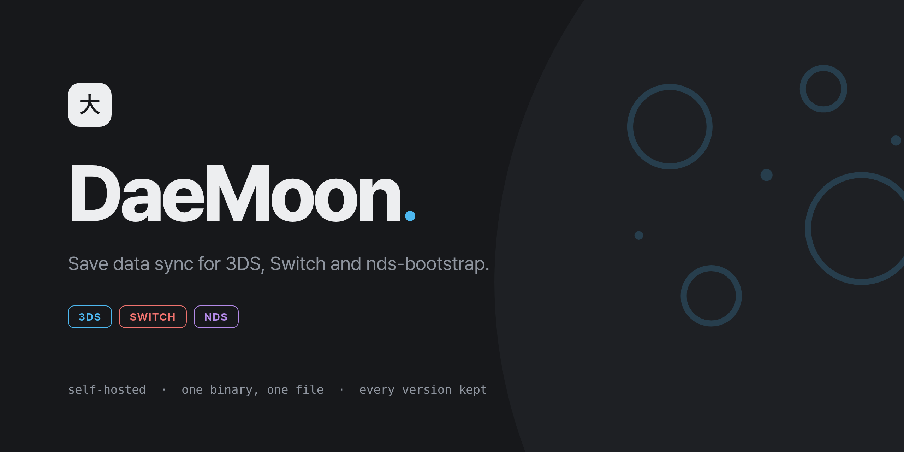
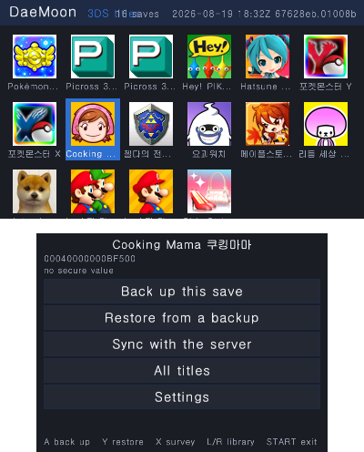
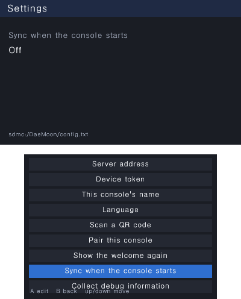

<p align="center">
  
</p>

Save data sync for 3DS, Switch and nds-bootstrap, backed by a self-hostable server.

## What it looks like

<p align="center">
  
  
</p>

The name is Korean for "main gate" (대문). The resemblance to "daemon" is wordplay:
there is no background daemon here and there cannot be one, because syncing while a
game holds a save archive corrupts it.

**Status: the 3DS client is complete and running on hardware.** It discovers
installed 3DS and nds-bootstrap titles, makes local backups, restores and syncs
individual saves or the whole library, pairs with a server and can sync at startup.
The shared core, the desktop backend, the server, the web panel and the
internationalization pipeline are done and tested. The Switch client is an NRO
that lists a chosen account's saves, backs one up and syncs one.

## What works today

- `core/`: manifests, save packages, the payload digest, conflict resolution, the
  API client, and the text layer. C11, no platform headers.
- `platform/posix/`: a directory presented as a save archive, plus a plain HTTP
  backend, so the whole sync path runs on a build machine.
- `server/`: Go, SQLite, one static binary and one database file.
- the web panel it serves: a landing page, pairing by QR or device code, and the
  saves, consoles and people behind a login. Eight languages, three themes, and
  every control in it still works with JavaScript off.
- `tools/cli/`: `daemoonctl`, a desktop client that links the same core a console
  build links.
- 57,000 core checks and the Go suite, both green, with the address and undefined
  behaviour sanitizers on for the C side, plus fuzzing on both sides' parsers.
- Reproducible builds for all three targets in containers, including the 3DS CIA.

## Try it

```bash
make server                     # build/daemoond
make -C tools/cli ROOT=$PWD     # build/daemoonctl

mkdir -p /tmp/dm/saves/3ds_0004000000055D00
echo "player data" > /tmp/dm/saves/3ds_0004000000055D00/main.sav

DAEMOON_DB=/tmp/dm/daemoon.db ./build/daemoond &
DAEMOON_DB=/tmp/dm/daemoon.db ./build/daemoond -pair alice   # prints a code

cd /tmp/dm
daemoonctl=~/DaeMoon/build/daemoonctl
$daemoonctl --saves saves --work work pair <code>            # prints a token
export DAEMOON_TOKEN=...
$daemoonctl --saves saves --work work list
$daemoonctl --saves saves --work work sync
```

Point a second `--saves`/`--work` pair at a different directory to play the part of
a second console, change both sides, and watch the conflict dialog. `--lang ko`
switches the language.

## Build

Containers, so there is no toolchain to install. See `docs/build.md`.

```bash
make docker-images   # once
make docker-test     # core, server and end to end suites
make docker-cia      # platform/3ds/daemoon.cia
make docker-nx       # platform/nx/daemoon.nro
```

Or directly, on a machine that already has the tools:

```bash
make test         # core tests plus go tests, no console required
make core-test    # core only, the main development loop
make check        # everything CI runs except the console builds
make server
```

Working on the 3DS itself goes over wifi rather than by moving the SD card - see
`docs/3ds-workflow.md`.

Both console targets link the whole shared core, which is the point of `core/`
being free of platform assumptions in a way three compilers agree on rather than
in a way a grep believes.

The image at the top is `docs/cover.html`, rendered by `make cover`. It is
committed rather than generated on demand, because the wordmark has to be set in
the typeface the panel ships and not in whatever the reader happens to have.

## Layout

```
core/         C11, shared by every platform. No platform headers, enforced by CI.
platform/     3ds (libctru), nx (libnx), posix (desktop, test and development)
server/       Go, SQLite, one binary
shared/       the contracts: errors, language files, the OpenAPI spec, fixtures
tools/        code generation, the spec check, the core tests, daemoonctl
vendor/       miniz, jsmn, quirc and the root certificates, copied in
docs/         the format, the i18n pipeline, and the open font question
```

## The rules that matter

Save data loss is unrecoverable, so a handful of things are not negotiable. They are
written out in `CLAUDE.md` and tested in `tools/test/test_sync.c`:

- back up locally before restoring, and abort the restore if the backup fails
- never auto merge; the user chooses and both versions are kept
- always commit after writing, and treat a failed commit as a failed restore
- never decide freshness by timestamp; the console clock is user settable
- verify the digest immediately before restoring
- every destructive action goes through a confirmation, and there is no force flag

## Contributing

`make check` before opening a pull request. It runs the generator in check mode, the
core isolation grep, the spec check, and both test suites.

Read `CLAUDE.md` first. Each top level directory has its own with the specifics.
